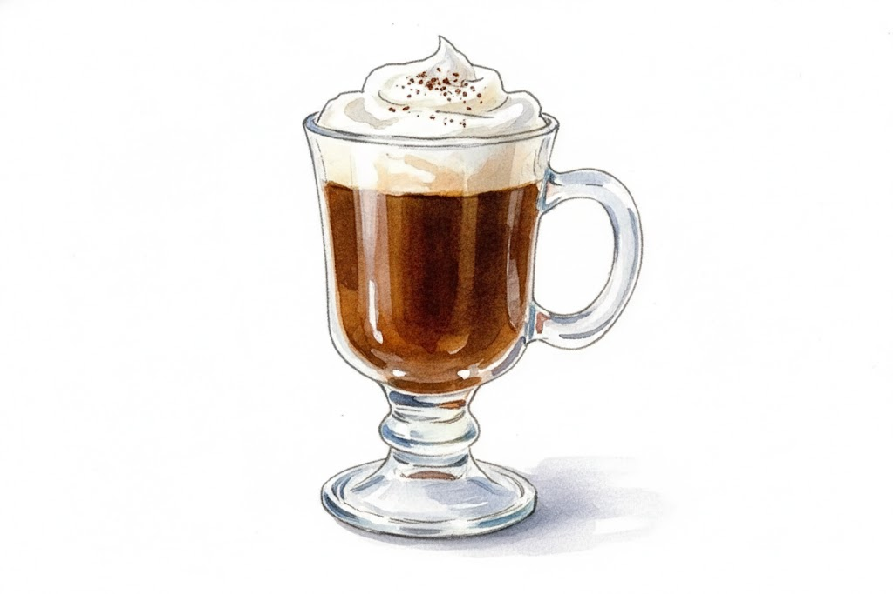

# Classic Irish Coffee

## Ingredients:
- 45ml Irish Whiskey
- 120ml Hot freshly brewed coffee
- 2 tsp Brown sugar
- Heavy cream (lightly whipped)

## Recipes:

1. Pre-heat a glass with hot water, then discard the water.
2. Add the whiskey, coffee, and sugar. Stir until the sugar is dissolved.
3. Gently pour the whipped cream over the back of a spoon so it floats on top. Do not stir.