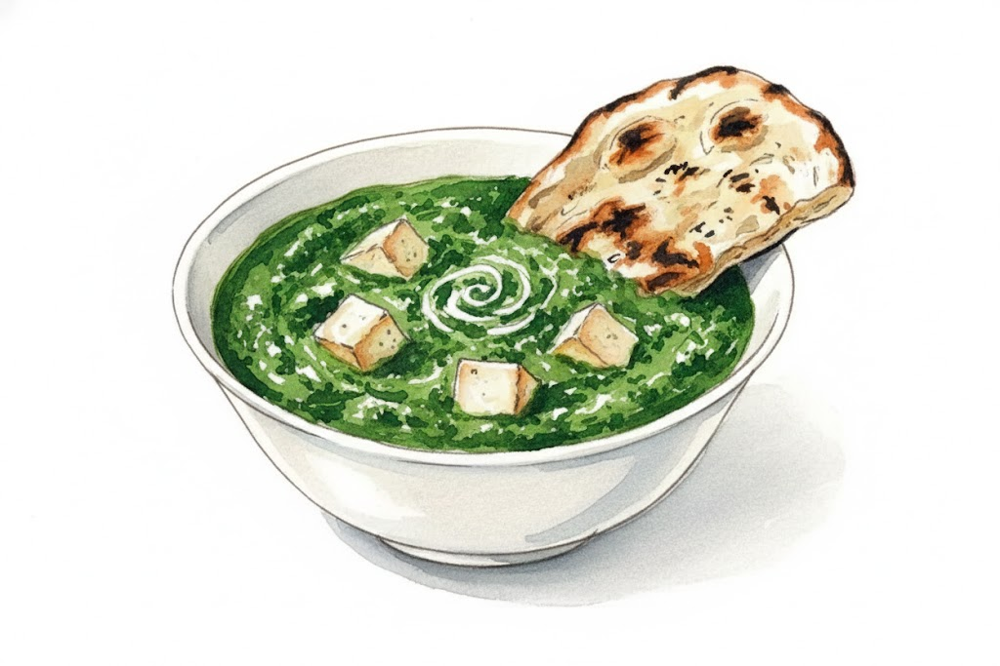

# Palak Paneer

## Ingredients
- Spinach
- Paneer
- Oil/Butter
- Cumin (Jeera)
- Onion
- Chilli
- Garlic
- Ginger
- Turmeric
- Red Chilli powder
- coriander powder
- Cream or Cream Substitute (optional)

## Recipe
1. Cut spinach leaves removing hard stems
2. Boil water in a pan and add cut spinach leaves, blanch and strain
3. To make masala add oil, cumin, fine cut onion, chilli and garlic and ginger
4. Fry until the onion caramelize and add finely chopped tomato
5. Let it cool off and add with blanched spinach in mixer and let it run
6. Add butter/oil, add turmeric, red chilli, coriander powder and mix on low heat and add spinach
7. Add some water for right consistency
8. 1 tbsp salt
9. Cook on low heat for 5 mins
10. Add chunks of paneer
11. Cook on low heat for 5 mins
12. Add Cream/yogurt/milk (optional)
13. Enjoy

### [Source Youtube Video](https://www.youtube.com/watch?v=JI4DtsiYm34)