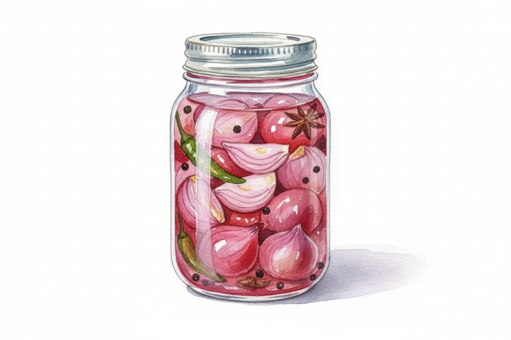

# Chicken Fried Rice

## Ingredients
1. Small Onions: 15–20 (peeled, with an "X" cut on top).
2. Liquid: 1 cup vinegar, ½ cup water.
3. Seasoning: 2 tsp sugar, 1 tsp salt.
4. Color: 4–5 slices of beetroot.

## Recipe  
The 3-Step Method Mix:  
1. Stir the vinegar, water, sugar, and salt in a jar until dissolved.
2. Pack: Add the onions and beetroot slices to the jar. Make sure the onions are fully covered by the liquid.
3. Wait: Let the jar sit on your counter for 24 hours.